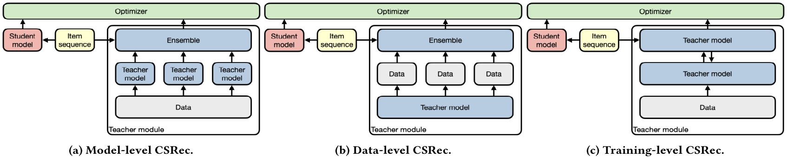

# Learning Robust Sequential Recommenders through Confident Soft Labels

## Paper summary

\
*Framework of CSRec, with (a) model-level teachers, (b) data-level teachers, and (c) training-level teachers*

In this work, we propose CSRec, a new learning framework for sequential recommenders. The key insight is to introduce <u>**c**</u>onfident <u>**s**</u>oft labels to provide robust guidance when learning from useritem interactions. More precisely, CSRec contains a teacher module that generates high-quality and confident soft labels and a student module that acts as the target recommender and is trained on the combination of dense, soft labels and sparse, one-hot labels.

We propose and compare three approaches to constructing the teacher module: (i) model-level, (ii) data-level, and (iii) training-level. To evaluate the effectiveness and generalization ability of CSRec, we conduct experiments using various state-of-the-art sequential recommendation models as the target student module on four benchmark datasets. Our experimental results demonstrate that CSRec is effective in training better performing sequential recommenders. 

## Running experiments

### Requirements

This code is written in PyTorch. Any version later than 1.10 is expected to work with the provided code. Please refer to the [official website](https://pytorch.org/) for an installation guide.

We recommend to use conda for installing the requirements. If you haven't installed conda yet, you can find instructions [here](https://www.anaconda.com/products/individual). The steps for installing the requirements are:

+ Create a new environment

   ```
   conda create env -n CSRec
   ```

   In the environment, a python version >= 3.8 should be used.

+ Activate the environment

   ```
   conda activate CSRec
   ```

+ Install the requirements within the environment via pip:

   ```
   pip install -r requirements.txt
   ```

### Datasets

+ [Last.FM](https://grouplens.org/datasets/hetrec-2011/),

+ [Yelp](https://www.yelp.com/dataset) and

+ two categories (e.g., *Electronics* and *Movies and TV*) of [Amazon](http://jmcauley.ucsd.edu/data/amazon/) datasets to assess our methods. 

We use the preprocessed dataset from [Recbole](https://github.com/RUCAIBox/RecSysDatasets), and further process them according to our paper (remove users and items with less than five interactions for all datasets). The final version of dataset is put in `Data`.

### Training

[note]: In the code, `dvae` denotes CSRec-T.

The config files are in corresponding directories (e.g., `config2.electronics`, etc.)

The most useful arguments are `T`, `alpha` and `dvae_alpha`, which corresponds to $\mathcal{T}$, $\beta$ and $\alpha$ in the paper.

For CSRec-M, the reference configurations are called `config_distill_ensemble.json`, you can directly run it which will automatically train the teachers and student.

```bash
python main.py --config_file="config_distill_ensemble.json"
```

For CSRec-D, the reference configurations are called `config_distill_partial.json`. Currently you need to train teachers with sub-datesets manually, with proper configurations,

```bash
python main.py --config_file="config_partial.json"
```

then,

```bash
python main.py --config_file="config_distill_partial.json"
```

For CSRec-T, the reference configurations are called `config_dvae.json`. The training process is similar to CSRec-D. First you need trained teachers using sub-datasets, then,

```bash
python main.py --config_file="config_dvae.json"
```

### Testing

```bash
python main.py --config_file="config_test.json"
```